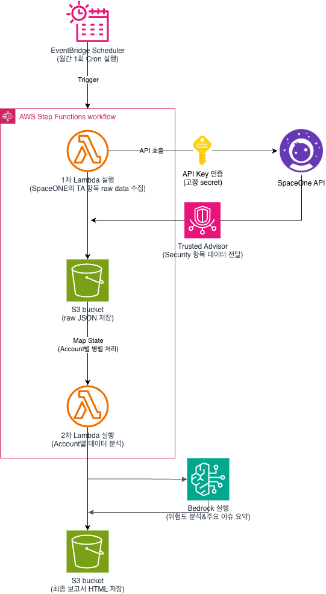

# TA Security Report Automation

Cloudforet(SpaceONE) API를 활용하여 AWS Trusted Advisor Security 진단 결과를 수집하고, Account(Project) 단위의 HTML 보안 보고서를 자동 생성하는 Serverless 기반 자동화 프로젝트입니다.

## Overview

본 프로젝트는 Cloudforet 콘솔에서 수동으로 Export하던 AWS Trusted Advisor Security 점검 결과를 자동 수집하여 고객별 HTML 보고서를 생성하는 것을 목표로 합니다.

주요 기능

- SpaceONE API 기반 TA Security 데이터 수집
- Project / Project Group 매핑
- Account 단위 병렬 처리
- Amazon Bedrock 기반 AI 보안 분석
- HTML 보고서 자동 생성
- S3 저장 및 이력 관리

## Architecture

### Workflow

1. EventBridge Scheduler 실행
2. Lambda #1에서 SpaceONE API 호출
3. Trusted Advisor Security 데이터 수집
4. Raw JSON을 S3 저장
5. Step Functions Map State를 통해 Account별 병렬 처리
6. Lambda #2에서 Account별 데이터 분석
7. Amazon Bedrock을 이용한 AI 위험도 평가 및 조치 가이드 생성
8. HTML 보고서 생성
9. S3 최종 저장

## Output Example

생성되는 보고서에는 다음 정보가 포함됩니다.

- 프로젝트별 보안 진단 결과
- Error / Warning / OK 집계
- AI 기반 위험도 분석
- 우선순위 조치 항목
- 보안 권고 사항
